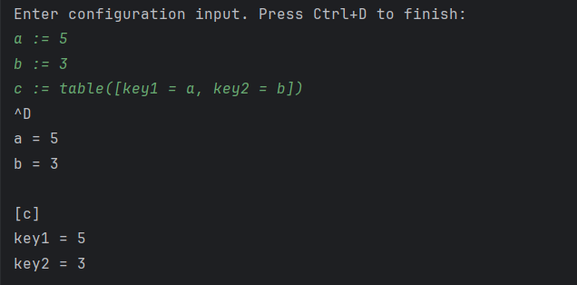

#  Учебный конфигурационный язык

## Постановка задачи

Необходимо разработать инструмент командной строки для учебного конфигурационного языка, который преобразует текст из входного формата в выходной. Программа должна:

1. Принимать входной текст на учебном конфигурационном языке из стандартного ввода.
2. Преобразовывать этот текст в формат TOML.
3. Выводить результат преобразования в стандартный вывод.
4. Выявлять синтаксические ошибки и выводить их с указанием описания.

### Синтаксис учебного конфигурационного языка

- **Комментарии**: начинаются с `"` и продолжаются до конца строки.
- **Константы**: создаются с помощью оператора `:=` и могут быть числами, таблицами или списками.
- **Ссылки на константы**: используются с помощью `?{константа}`.
- **Словари (таблицы)**: объявляются с помощью `table([ключ = значение, ...])`.
- **Списки**: задаются с помощью квадратных скобок `[элемент1, элемент2, ...]`.

Программа должна корректно обрабатывать вложенные структуры, включая списки внутри словарей и словари внутри списков.

---

## Описание функций программы

### `parse_line(line: str, constants: Dict[str, Any]) -> Any`
Обрабатывает одну строку входного текста:
- Распознаёт комментарии, константы, ссылки на константы, словари.
- Добавляет константы в словарь `constants`.
- Выдаёт результат разбора строки или вызывает исключение `SyntaxError`, если синтаксис неверный.

### `parse_table(content: str, constants: Dict[str, Any]) -> Dict[str, Any]`
Разбирает строку, представляющую словарь:
- Делит словарь на записи вида `ключ = значение`.
- Обрабатывает значения с помощью функции `parse_value`.

### `parse_value(value: str, constants: Dict[str, Any]) -> Any`
Обрабатывает отдельное значение:
- Распознаёт числа, таблицы, ссылки на константы и уже определённые константы.
- Возвращает результат или вызывает `SyntaxError`, если синтаксис неверный.

### `main()`
Основная функция программы:
- Читает входные данные из `stdin`.
- Построчно обрабатывает данные с помощью `parse_line`.
- Собирает результат в виде словаря и выводит его в формате TOML.
- Обрабатывает ошибки с выводом сообщения в `stderr` и завершает выполнение с кодом ошибки.

---

## Инструкция по использованию

1. **Запуск программы**:
   ```bash
   python3 script.py
   ```

2. **Ввод конфигурации**:
   Введите текст конфигурации, завершив ввод нажатием `Ctrl+D` (Linux/Mac) или `Ctrl+Z` (Windows).

3. **Пример ввода**:
   ```plaintext
   " Пример конфигурации
a := table([
    key1 = 5,
    key2 = table([
        subkey = 10,
        list = [1, 2, 3]
    ])
]);

b := [table([x = 1]), table([y = 2])];

c := ?{a.key2.list};
   ```

4. **Результат**: Программа преобразует конфигурацию в формат TOML и выведет результат:
   ```toml
a = { key1 = 5, key2 = { subkey = 10, list = [1, 2, 3] } }
b = [ { x = 1 }, { y = 2 } ]
c = [1, 2, 3]
   ```

---

## Пример работы программы

### Ввод:
```plaintext
" Пример конфигурации
a := table([
    key1 = 5,
    key2 = table([
        subkey = 10,
        list = [1, 2, 3]
    ])
]);

b := [table([x = 1]), table([y = 2])];

c := ?{a.key2.list};
```

### Вывод:
```toml
a = { key1 = 5, key2 = { subkey = 10, list = [1, 2, 3] } }
b = [ { x = 1 }, { y = 2 } ]
c = [1, 2, 3]
```

---

## Скриншот работы программы


